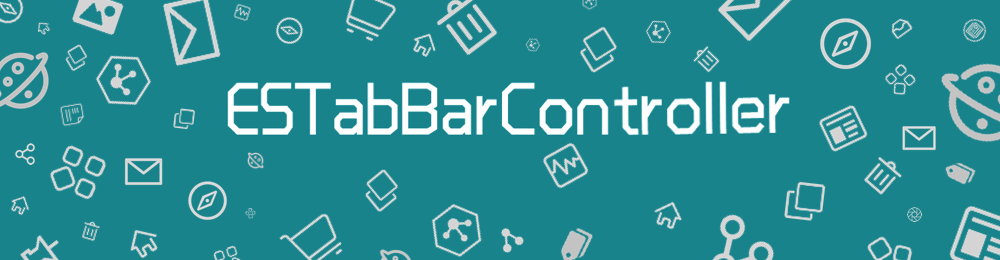

[](#swift-package-manager)
[](https://github.com/Carthage/Carthage)
[](http://cocoapods.org/pods/ESTabBarController-swift)
[](https://developer.apple.com/swift/)
[](https://twitter.com/lihao_iOS)
[](http://weibo.com/5120522686/profile?rightmod=1&wvr=6&mod=personinfo&is_all=1)
[](https://gitter.im/ESTabBarController/Lobby?utm_source=badge&utm_medium=badge&utm_campaign=pr-badge&utm_content=badge)

### [中文介绍](README_CN.md)

**ESTabBarController** is a highly customizable TabBarController component, which is inherited from UITabBarController.

### Why?

In real-world development, we may encounter the situation that customizing the UITabBar. For instance: change font style, add animation, use bigger item. However it's hard to do with UITabBarItem.

**With ESTabBarController, You can easily achieve these！**

-| Feature |Description
-------------|-------------|-------------
1| Default style | You can get system-like style by initializing the TabBar with ESTabBarController directly.  </p> UITabBarController style: </p> 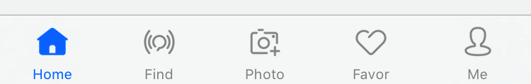 </p> ESTabBarController default style: </p> 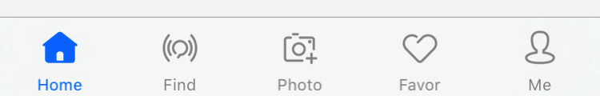
2| Default style with "More" item | If the items are more than the maximum number of displays, there will be a "More" item. </p> UITabBarController with "More": </p> 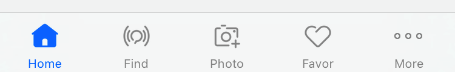 </p> ESTabBarController with "More": </p> 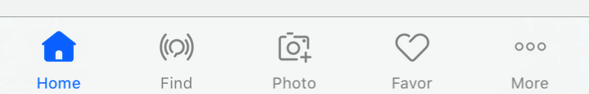
3| Mix UITabBarItem and ESTabBarItem | You can set any item as you want, including UITabBarItem and ESTabBarItem. </p> ESTabBar and UITabBar mixed style: </p>  </p> ESTabBar and UITabBar mixed style with "More": </p> 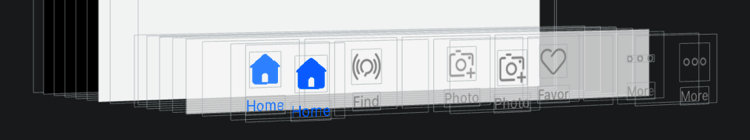
4| UIKit attributes | ESTabBarController is compatible with UITabBarController, UITabBar and UITabBarItem's most API attributes. You can migrate to ESTabBarController without any modification of the origin code.  </p> Compatible with UITabBarController's `selectedIndex`: </p> 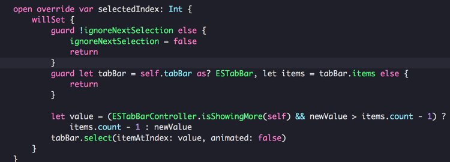
5| Any nesting with UINavigationController | Developing with`UITabBarController`, there are two common ways to handle layers: </p> First : </p> ├── UITabBarController </p> └──── UINavigationController </p> └────── UIViewController </p> └──────── SubviewControllers </p> Second : </p> ├── UINavigationController </p> └──── UITabBarController </p> └────── UIViewController </p> └──────── SubviewControllers </p> In the first case, need to set `hidesBottomBarWhenPushed = true` when pushing subViews. The second is not. </p> In ESTabBarController, add Container views to UITabBar to be compatible with these two ways。
6| Customizable style | With ESTabBarController, you can：</p> 1. Customize selected item's color and style: </p> 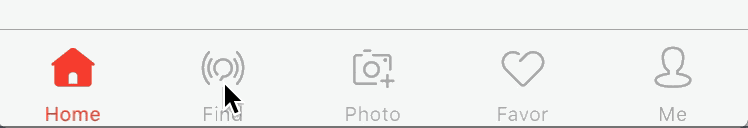 </p> 2. Add selecting animation:  </p> 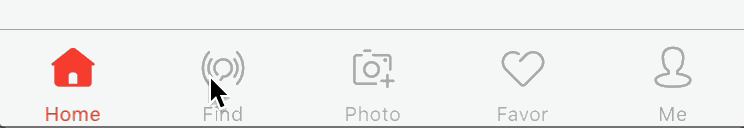 </p> 3. Customize item's background color: </p> 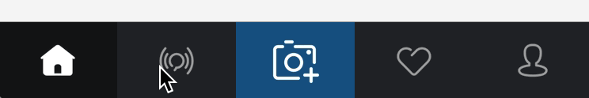 </p> 4. Add highlight animation: </p> 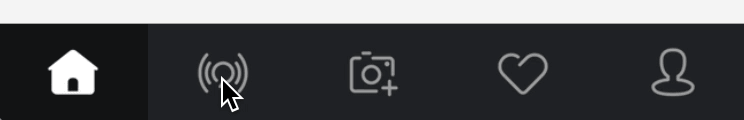 </p> 5. Add animation to prompt users: </p> 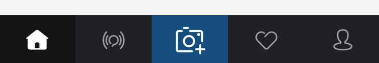 </p> 6. And much more ... </p>
7| Customizable item's size </p> Customizable click event | You can easily customize item's size using ESTabBarController. </p> **When the button's frame is larger than TabBar, through the use of HitTest to achieve making outer TabBar area click valid.** </p> In addition, ESTabBarController can customize click event, and through a block to callback super-layer to handle. </p> With big item in the middle of TabBar: </p> 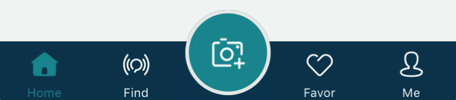 </p> With a special hint style: </p> 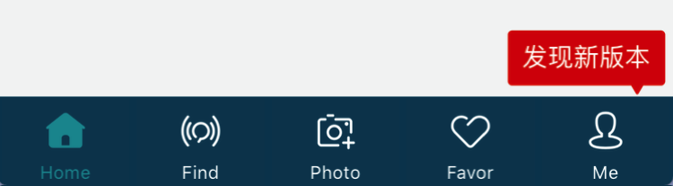 </p> Customize click event: </p> 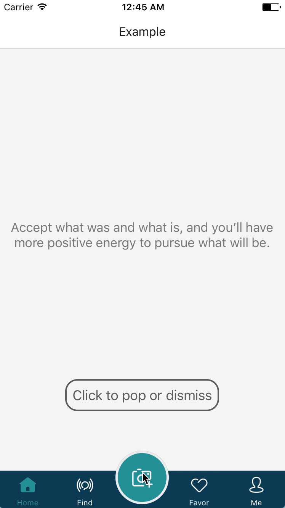
8| Default notification style |  You can get system-like notification style by initializing the TabBar with ESTabBarController directly. </p> UITabBarController notification style: </p> 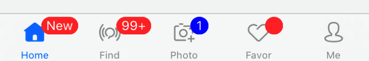 </p> ESTabBarController system-like notification style: </p> 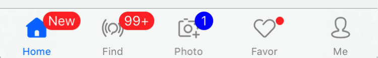
9| Customizable notification style | With ESTabBarController, you can：</p> 1. Customize notification animation: </p> 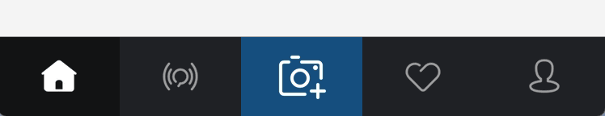 </p> 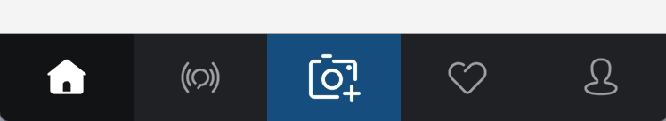 </p> 2. Customize prompt style: </p> 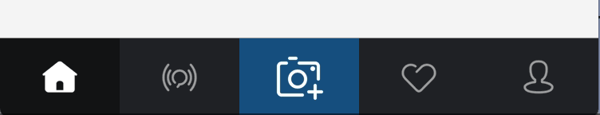 </p> 3. And much more ... </p>
10| Lottie | Through customizing ContentView, you are able to add Lottie's LAAnimationView to Item(s) </p> 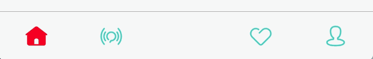

## Requirements

* Xcode 8 or later
* iOS 8.0 or later
* ARC
* Swift 5 or later

## Demo

You can download and build ESTabBarControllerExample project, and you will find more examples to use ESTabBarController, and also more examples to customize UITabBar。

## Usage

### CocoaPods

``` ruby
pod "ESTabBarController-swift"
```

### Carthage

```ruby
github "eggswift/ESTabBarController"
```

### Manually

``` ruby
git clone https://github.com/eggswift/ESTabBarController.git
open ESTabBarController
```

## TODO

1. The Containers' layout is purely based on code，using Autolayout will be better.
2. When there is "More", if edit it will occurs problem.
3. Partial UITabBarItem attributes are not bridge to ESTabBarItem.
4. ~~The picture of 'More' item in ESTabBarItemMoreContentView is not set into framework, plan to convert it to CGBitmap.~~


## Acknowledgement

* [animated-tab-bar](https://github.com/Ramotion/animated-tab-bar) by <http://ramotion.com> 
* Partial pictures in Example are from <http://www.iconfont.cn>


## About

ESTabBarController is developed and maintained by [Vincent Li](mailto:lihao_iOS@hotmail.com). If you have any questions or issues in using ESTabBarController, welcome to [issue](https://github.com/eggswift/ESTabBarController/issues). </br>
If you want to contribute to ESTabBarController, Please submit [Pull Request](https://github.com/eggswift/ESTabBarController/pulls), I will deal with it as soon as possible. </br>

[](https://twitter.com/intent/tweet?text=https://github.com/eggswift/ESTabBarController)
[](https://twitter.com/lihao_iOS)


## License

The MIT License (MIT)

Copyright (c) 2013-2016 eggswift. All rights reserved.

Permission is hereby granted, free of charge, to any person obtaining a copy of this software and associated documentation files (the "Software"), to deal in the Software without restriction, including without limitation the rights to use, copy, modify, merge, publish, distribute, sublicense, and/or sell copies of the Software, and to permit persons to whom the Software is furnished to do so, subject to the following conditions:

The above copyright notice and this permission notice shall be included in all copies or substantial portions of the Software.

THE SOFTWARE IS PROVIDED "AS IS", WITHOUT WARRANTY OF ANY KIND, EXPRESS OR IMPLIED, INCLUDING BUT NOT LIMITED TO THE WARRANTIES OF MERCHANTABILITY, FITNESS FOR A PARTICULAR PURPOSE AND NONINFRINGEMENT. IN NO EVENT SHALL THE AUTHORS OR COPYRIGHT HOLDERS BE LIABLE FOR ANY CLAIM, DAMAGES OR OTHER LIABILITY, WHETHER IN AN ACTION OF CONTRACT, TORT OR OTHERWISE, ARISING FROM, OUT OF OR IN CONNECTION WITH THE SOFTWARE OR THE USE OR OTHER DEALINGS IN THE SOFTWARE.

