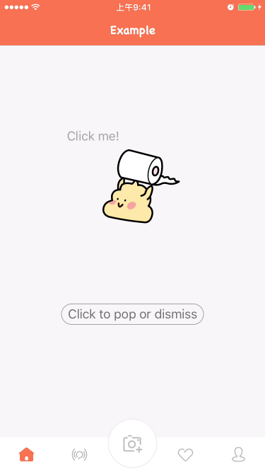
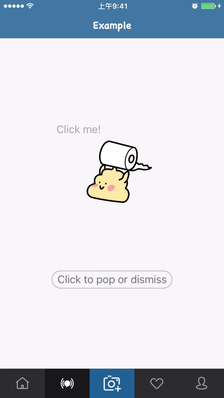
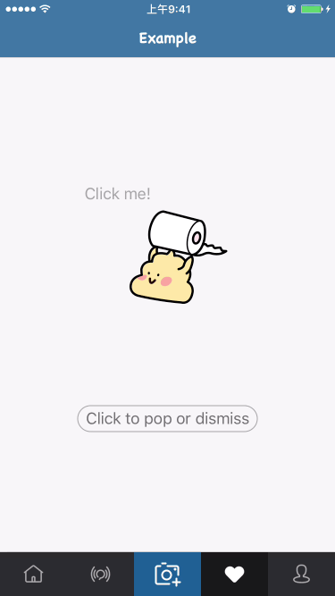

<center></center>
# ESTabBarController
---
[](https://travis-ci.org/eggswift/ESTabBarController)
[](http://cocoapods.org/pods/ESTabBarController-swift)
[](https://github.com/Carthage/Carthage)
[](https://developer.apple.com/swift/)
[](https://twitter.com/lihao_iOS)
[](http://weibo.com/5120522686/profile?rightmod=1&wvr=6&mod=personinfo&is_all=1)

ESTabBarController是使用Swift语言开发的自定义TabBarController组件，继承自UITabBarController。

### 为什么要使用

在开发工作中，我们可能会遇到需要自定义UITabBar的情况。例如：改变文字样式、添加一些动画效果、设置一个比默认更大的样式等等，以上需求如果只通过UITabBarItem往往很难实现。

**有了ESTabBarController，你可以轻松地实现这些！**

1. UITabBarController 和 UINavigationController 对象任意嵌套
2. 支持横竖屏、分屏任意切换
3. 支持自动把多出的 tab 添加到 More Item
4. 自定义显示文字样式或图片甚至不规则的Item
5. 添加切换到选中、取消选中、高亮等状态时的效果和动画
6. 挟持 Item 的点击事件，实现自定义跳转
7. 实现带有引导用户点击的 Item 样式
8. 等等...

## 支持环境

* Xcode 7.0 or later
* iOS 8.0 or later
* ARC

## 安装
### 使用CocoaPods

```ruby
pod "ESTabBarController-swift"
```

### 使用Carthage

```ruby
github "eggswift/ESTabBarController"
```

### 手动安装

```ruby
git clone https://github.com/eggswift/ESTabBarController.git
open ESTabBarController
```

## 开始使用

### UI层级相关

通常在使用`UITabBarController`过程中，会存在两种比较常见的层级处理方式：

第一种：

```swift
    - UITabBarController
    --- UINaviBarController
    ----- ViewController
    ------- SubViewController
```
第二种：

```swift
    - UINaviBarController
    --- UITabBarController
    ----- ViewController
    ------- SubViewController
```

第一种情况在push子视图的时候需要设置 `hidesBottomBarWhenPushed = true` , 第二种则不需要。

在ESTabBarController中，通过添加UITabBarItem对应`container view`视图到UITabBar上来兼容这两种层级处理方式。

具体实现代码：

```swift
    func example() {
        let vc = ESTabBarController.init()
        vc.title = "Example"

        let v1          = ExampleViewController()
        let v2          = ExampleViewController()
        let v3          = ExampleViewController()
        let v4          = ExampleViewController()
        let v5          = ExampleViewController()

        v1.tabBarItem   = ESTabBarItem.init(content: ESTabBarItemContent.init(animator: ExampleBaseAnimator.init()))
        v2.tabBarItem   = ESTabBarItem.init(content: ESTabBarItemContent.init(animator: ExampleBaseAnimator.init()))
        v3.tabBarItem   = ESTabBarItem.init(content: ESTabBarItemContent.init(animator: ExampleBaseAnimator.init()))
        v4.tabBarItem   = ESTabBarItem.init(content: ESTabBarItemContent.init(animator: ExampleBaseAnimator.init()))
        v5.tabBarItem   = ESTabBarItem.init(content: ESTabBarItemContent.init(animator: ExampleBaseAnimator.init()))

        v1.tabBarItem.image = UIImage.init(named: "home")
        v2.tabBarItem.image = UIImage.init(named: "find")
        v3.tabBarItem.image = UIImage.init(named: "photo")
        v4.tabBarItem.image = UIImage.init(named: "favor")
        v5.tabBarItem.image = UIImage.init(named: "me")
        v1.tabBarItem.selectedImage = UIImage.init(named: "home_1")
        v2.tabBarItem.selectedImage = UIImage.init(named: "find_1")
        v3.tabBarItem.selectedImage = UIImage.init(named: "photo_1")
        v4.tabBarItem.selectedImage = UIImage.init(named: "favor_1")
        v5.tabBarItem.selectedImage = UIImage.init(named: "me_1")

        v1.title        = "Home"
        v2.title        = "Find"
        v3.title        = "Photo"
        v4.title        = "List"
        v5.title        = "Me"

        let controllers = [v1, v2, v3, v4, v5]
        vc.viewControllers = controllers

        let nc = ExampleNavigationController.init(rootViewController: vc)
        self.presentViewController(nc, animated: true) { 

        }
    }
```

更多相关例子请查看`Example`中的 

```swift
    func systemStytle() 
    func naviContainTabBarStytle() 
    func tabBarContainNaviStytle()
```

 效果如下:


### UIMoreNavigationController

当ViewControllers大于一定数量后，UITabBarController会将多出的Tab整合到More Tab中，ESTabBarController可以很好的支持这种情况。通过

```swift
(moreNavigationController.parentViewController != nil) ? items.count - 1 : items.count 
```

来判断当前需要添加Container的UITabBarItem个数，若当前UITabBarController的UIMoreNavigationController对象存在并且parentViewController不为空，则表示出现More Tab情况

效果如下:


### 为TabBarItem添加效果

ESTabBarController 能够自定义TabBar的样式和表现形式，所以你可以通过继承 ESTabBarItemContent 或 ESTabBarItemAnimator 来分别实现自定义样式或表现效果。ESTabBarItemAnimator 通过实现 ESTabBarItemAnimatorProtocol 协议来约定动画效果的发生时机。
你也可以自定义自己的Animator，只需继承自 ESTabBarItemAnimatorProtocol 协议。
[Example](https://github.com/eggswift/ESTabBarController/tree/master/ESTabBarControllerExample)实现了自定义的Animator，你可以查看 ExampleBackgroundAnimator 、 ExampleSpreadAnimator 和 ExampleBounceAnimator 的实现方法。

 效果如下:




### 自定义点击事件

通过`shouldHijackHandler` 你可以决定 UITabBarController 是否响应点击并切换到对应的 index ，如果返回`false`表示本次点击被挟持。`hijackHandler`用来实现自定义点击事件的处理。

具体实现代码：

```swift
    let vc = ESTabBarController.init()
    vc.title = "Example"
    vc.shouldHijackHandler = {
        tabbarController, viewController, index in
        if index == 2 {
            return true
        }
        return false
    }

    vc.hijackHandler = {
        [weak vc] tabbarController, viewController, index in
        if index == 2 {
            let minseconds = 0.2 * Double(NSEC_PER_SEC)
            let dtime = dispatch_time(DISPATCH_TIME_NOW, Int64(minseconds))
            dispatch_after(dtime, dispatch_get_main_queue() , {
                let v1 = ExampleViewController()
                let n1 = ExampleNavigationController.init(rootViewController: v1)
                v1.title = "Example"
                vc?.presentViewController(n1, animated: true, completion: nil)
            })
        }
    }
```

 效果如下:




### 引导用户点击效果

`Example`中提供了一种引导用户点击某一Tab的动画效果。通过继承ESTabBarItemContent来实现自定义`TabBar`显示样式。

具体实现代码：

```swift
viewController.tabBarItem = ESTabBarItem.init(content: ExampleImpliesTabBarItemContent.init(animator: ExampleBackgroundAnimator.init(special: true)))
```

效果如下:




### 如何自定义

如果 [Example](https://github.com/eggswift/ESTabBarController/tree/master/ESTabBarControllerExample) 中的案例都不适合你的话，那么你就需要自定义你的TabBar。</br>
通过继承ESTabBarItemContent，你可以任意修改你的 UITabBarItem 样式，例如布局、子控件等等。注意：请设置 `userInteractionEnabled = false` 以保证 ESTabBarViewController 能够Handle你自定义的TabBar的点击事件。</br>
通过继承 ESTabBarItemAnimator ，或是任意对象遵守 `<ESTabBarItemAnimatorProtocol>` 协议，你可以自定义你想要的效果。</br>
例如 ExampleBounceAnimator 你需要先创建一个动画效果方法</br>

```swift
    func bounceAnimation(view: UIView) {
        let impliesAnimation = CAKeyframeAnimation(keyPath: "transform.scale")
        impliesAnimation.values = [1.0 ,1.4, 0.9, 1.15, 0.95, 1.02, 1.0]
        impliesAnimation.duration = duration * 2
        impliesAnimation.calculationMode = kCAAnimationCubic
        view.layer.addAnimation(impliesAnimation, forKey: nil)
    }
```

ExampleBounceAnimator 继承自ESTabBarItemAnimator，实现 `<ESTabBarItemAnimatorProtocol>`协议方法

```swift
    public override func selectAnimation(content content: UIView, animated: Bool, completion: (() -> ())?) {
        super.selectAnimation(content: content, animated: animated, completion: completion)
        if let content = content as? ESTabBarItemContent {
            /// 将动画效果添加到此处即可
            self.bounceAnimation(content.imageView)
        }
    }

    public override func reselectAnimation(content content: UIView, animated: Bool, completion: (() -> ())?) {
        super.reselectAnimation(content: content, animated: animated, completion: completion)
        if let content = content as? ESTabBarItemContent {
            /// 将动画效果添加到此处即可
            self.bounceAnimation(content.imageView)
        }
    }

    public override func deselectAnimation(content content: UIView, animated: Bool, completion: (() -> ())?) {
        super.deselectAnimation(content: content, animated: animated, completion: completion)
    }
```

## 未完成的事

1. Containers的布局方式目前是纯代码布局，使用Autolayout应该会更好。
2. 在 iPadx 或 iPhone6x Plus 横屏时，Containers的布局并没有考虑到`itemWidth`和`itemSpacing`的处理，这使得在出现"More"时有一些问题。
3. ...

## 感谢:

* [animated-tab-bar](https://github.com/Ramotion/animated-tab-bar) by <http://ramotion.com> 
* Example中部分图片资源来自 <http://www.iconfont.cn>


## 关于

ESTabBarController是由[lihao](mailto:lihao_iOS@hotmail.com)开发和维护。如果你在使用过程中遇到什么疑问或任何问题，欢迎提交 [issue](https://github.com/eggswift/ESTabBarController/issues) 随时交流。</br>
如果你想为ESTabBarController输出代码，请提交 [Pull Request](https://github.com/eggswift/ESTabBarController/pulls)，我会尽可能快的去处理。</br>

[](https://twitter.com/intent/tweet?text=https://github.com/eggswift/ESTabBarController)
[](https://twitter.com/lihao_iOS)

## License

The MIT License (MIT)

Copyright (c) 2013-2015 eggswift. All rights reserved.

Permission is hereby granted, free of charge, to any person obtaining a copy of this software and associated documentation files (the "Software"), to deal in the Software without restriction, including without limitation the rights to use, copy, modify, merge, publish, distribute, sublicense, and/or sell copies of the Software, and to permit persons to whom the Software is furnished to do so, subject to the following conditions:

The above copyright notice and this permission notice shall be included in all copies or substantial portions of the Software.

THE SOFTWARE IS PROVIDED "AS IS", WITHOUT WARRANTY OF ANY KIND, EXPRESS OR IMPLIED, INCLUDING BUT NOT LIMITED TO THE WARRANTIES OF MERCHANTABILITY, FITNESS FOR A PARTICULAR PURPOSE AND NONINFRINGEMENT. IN NO EVENT SHALL THE AUTHORS OR COPYRIGHT HOLDERS BE LIABLE FOR ANY CLAIM, DAMAGES OR OTHER LIABILITY, WHETHER IN AN ACTION OF CONTRACT, TORT OR OTHERWISE, ARISING FROM, OUT OF OR IN CONNECTION WITH THE SOFTWARE OR THE USE OR OTHER DEALINGS IN THE SOFTWARE.

